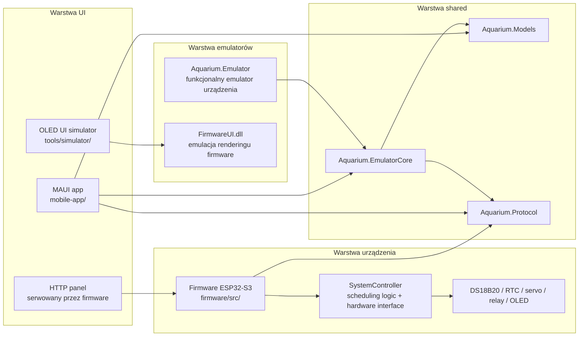

# Aquarium Controller

System sterowania akwarium oparty o ESP32-S3, z lokalnym interfejsem OLED, panelem HTTP, komunikacją BLE, aktualizacją OTA oraz zestawem emulatorów do pracy bez fizycznego urządzenia.

## Cel projektu

Repozytorium łączy kilka warstw wykonawczych:

- firmware embedded dla `ESP32-S3` budowane przez `PlatformIO` i `Arduino`,
- aplikację operatorską `MAUI` dla Windows i Androida,
- emulator funkcjonalny urządzenia w `C# WinForms`,
- emulator UI firmware oparty o natywną bibliotekę `C++`,
- warstwę shared z modelami domenowymi i kontraktami komunikacyjnymi,
- narzędzia testowe, prototypy i dokumentację operacyjną.

## Kluczowe funkcje

- harmonogramy pracy dla oświetlenia, filtra i napowietrzania,
- pomiar temperatury `DS18B20` i fail-safe dla grzałki,
- automatyczne i ręczne karmienie z obsługą sensora oraz timeoutu bezpieczeństwa,
- lokalny panel HTTP z REST API i aktualizacją `HTTP OTA`,
- komunikacja `BLE GATT` z obsługą komend, ustawień, statusu i `BLE OTA`,
- lokalne UI na wyświetlaczu `OLED 128x32` sterowane przez state machine,
- emulacja urządzenia i emulacja renderingu OLED bez fizycznego hardware,
- współdzielone modele i abstraction layer dla transportów `real device` vs `emulator`.

## Architektura



Logika biznesowa jest rozdzielona od transportu. Aplikacja MAUI komunikuje się przez abstraction layer `IBluetoothService`, który przełącza się między fizycznym urządzeniem a emulatorem. Firmware utrzymuje spójny model runtime przez `SharedState`, `ConfigManager`, `ScheduleManager` i `SystemController`.

## Układ repozytorium

Aktualny układ fizyczny repozytorium:

```text
.
|-- firmware/
|-- mobile-app/
|-- apps/
|   |-- Aquarium.Emulator/
|   |-- Aquarium.Mobile/
|   `-- Aquarium.Desktop/
|-- shared/
|-- scripts/
|-- tools/
|   |-- simulator/
|   |-- testing/
|   `-- testy/
`-- docs/
```

Ważne doprecyzowanie:

- `mobile-app/` zawiera rzeczywisty host MAUI dla Androida i Windows.
- `apps/Aquarium.Mobile/` oraz `apps/Aquarium.Desktop/` pełnią obecnie rolę logicznych punktów odniesienia dla architektury.
- `apps/Aquarium.Emulator/` to emulator funkcjonalny urządzenia.
- `tools/simulator/` to osobna ścieżka emulacji UI OLED oparta o kod firmware.

## Quick Start

### Firmware

1. Skopiuj `firmware/src/arduino_secrets.template.h` do `firmware/src/arduino_secrets.h`.
2. Uzupełnij `SECRET_SSID`, `SECRET_PASS`, `AP_SSID`, `AP_PASSWORD`, `SECRET_BLE_PASSKEY`.
3. Zbuduj firmware:

```powershell
python -m platformio run
```

4. Wgraj firmware:

```powershell
python -m platformio run -t upload
python -m platformio device monitor -b 115200
```

### Emulator funkcjonalny

```powershell
dotnet run --project apps/Aquarium.Emulator/Aquarium.Emulator.csproj
```

Domyślnie emulator udostępnia lokalne API pod `http://127.0.0.1:5080/`.

### Aplikacja MAUI

Windows:

```powershell
dotnet run --project mobile-app/AquariumController.Mobile.csproj -f net10.0-windows10.0.19041.0
```

Android:

```powershell
dotnet build mobile-app/AquariumController.Mobile.csproj -f net10.0-android
```

### Emulator UI OLED

```powershell
cmake -S tools/simulator/FirmwareUI -B tools/simulator/FirmwareUI/build -A x64
cmake --build tools/simulator/FirmwareUI/build --config Release
dotnet run --project tools/simulator/Aquarium.ControllerEmulator/Aquarium.ControllerEmulator.csproj
```

## Dokumentacja

- [Architektura](docs/architecture.md)
- [Firmware](docs/firmware.md)
- [Emulatory](docs/emulator.md)
- [UI](docs/ui.md)
- [Komunikacja](docs/communication.md)
- [Testowanie](docs/testing.md)
- [Setup](docs/setup.md)
- [Development](docs/development.md)
- [Manual smoke test](docs/manual_smoke_test.md)
- [Raport weryfikacji technicznej](docs/technical_verification_report.md)

## Design Decisions

- Zachowany został legacy wire format dla firmware, a nowa warstwa shared dodaje canonical model i mappery kompatybilności.
- Główna logika urządzenia pozostaje w firmware, a emulatory odwzorowują kontrakty i zachowanie zamiast kopiować każdy detal hardware.
- Warstwa UI korzysta z transport abstraction layer, dzięki czemu te same ekrany mogą działać z fizycznym BLE i z emulatorem.
- Dokumentacja rozdziela opis systemowy od dokumentacji lokalnej katalogów, aby ograniczyć redundancję.

## Known Limitations

- Repozytorium zawiera dwa różne nurty emulatorów i jeden eksperymentalny analizator UI, co podnosi próg wejścia bez dobrej dokumentacji.
- `apps/Aquarium.Mobile/` i `apps/Aquarium.Desktop/` nie zawierają osobnych implementacji; rzeczywisty kod hosta jest w `mobile-app/`.
- W warstwie testów dominują scenariusze manualne i emulacyjne; brak pełnego, automatycznego zestawu testów jednostkowych i integracyjnych.
- W firmware tryb `heaterMode=Off` nie odcina fizycznie grzałki w sposób intuicyjny dla warstwy UI, ponieważ aktualna implementacja działa jako bezpiecznik sprzętowy, nie klasyczny termostat.

## Future Improvements

- Wydzielenie jawnego modułu communication protocol z jedną definicją payloadów dla HTTP i BLE.
- Dodanie automatycznych testów kontraktowych dla `shared/`, emulatora i firmware.
- Ujednolicenie ścieżki emulatorów do jednego scenariusza developerskiego.
- Rozdzielenie hostów `mobile` i `desktop` na osobne projekty tylko wtedy, gdy zacznie się różnicować UX lub hardware integration.
