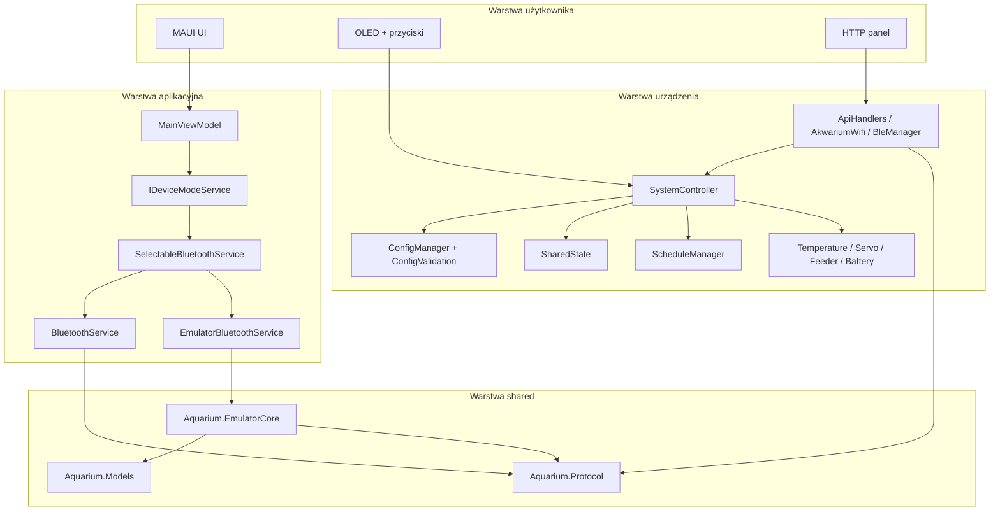

# Architektura systemu

## Zakres

Ten dokument opisuje docelową architekturę techniczną projektu na podstawie aktualnego kodu repozytorium. Obejmuje komponenty runtime, przepływ danych, granice odpowiedzialności i kluczowe abstraction layers.

## Komponenty systemu

### Firmware

Firmware w `firmware/src/` realizuje logikę embedded dla `ESP32-S3`. Punktem centralnym jest `SystemController`, który koordynuje sensory, scheduling logic, hardware interface, stan runtime i przejścia zasilania.

### Emulator

W repozytorium istnieją dwa istotne nurty emulacji:

- `apps/Aquarium.Emulator/` symuluje zachowanie urządzenia i udostępnia zgodne API na potrzeby aplikacji oraz testów.
- `tools/simulator/` symuluje wyłącznie warstwę UI OLED, wykorzystując realne funkcje renderujące firmware przez natywną bibliotekę `FirmwareUI.dll`.

### UI

Rzeczywista aplikacja operatorska znajduje się w `mobile-app/`. Warstwa UI działa jako klient transportu i nie powinna implementować reguł sterowania hardware. Wbudowany panel HTTP serwowany przez firmware jest osobnym UI operacyjnym.

### Shared

Warstwa `shared/` zawiera trzy biblioteki:

- `Aquarium.Models` - kanoniczne modele domenowe,
- `Aquarium.Protocol` - kontrakty transportowe, UUID BLE, DTO legacy i mappery,
- `Aquarium.EmulatorCore` - silnik emulacji urządzenia.

## Diagram logiczny

## Warstwy odpowiedzialności

### State machine

Firmware utrzymuje lokalną state machine OLED w `AkwariumV4.ino`. Jest to warstwa interakcji lokalnej, nie główny model domenowy urządzenia.

### Scheduling logic

`ScheduleManager` wylicza aktywne okna pracy dla światła, filtra, napowietrzania i auto-karmienia. `SystemController` konsumuje te decyzje i aplikuje je do hardware interface.

### Hardware interface

Sterowanie pinami, sensorami i actuatorami jest zamknięte w modułach:

- `TemperatureController`,
- `FeederController`,
- `ServoController`,
- `BatteryReader`,
- `PowerManager`.

### Communication protocol

Firmware utrzymuje dwa równoległe interfejsy:

- `HTTP/JSON` przez `AkwariumWifi` i `ApiHandlers`,
- `BLE GATT/JSON` przez `BleManager`.

Warstwa .NET utrzymuje dodatkowo canonical envelope w `Aquarium.Protocol`, ale wire format urządzenia pozostaje kompatybilny z legacy DTO.

## Przepływ danych

### Odczyt statusu

1. Sensor i kontrolery aktualizują stan runtime.
2. `SystemController` publikuje snapshot do `SharedState`.
3. `ApiHandlers` i `BleManager` serializują snapshot do JSON.
4. UI lub emulator odczytuje payload i mapuje go na modele lokalne.

### Zapis konfiguracji

1. UI tworzy payload ustawień.
2. Payload trafia przez HTTP albo BLE.
3. `ConfigValidation` waliduje i sanitizuje patch.
4. `ConfigManager` zapisuje konfigurację do `Preferences` z CRC.
5. `SystemController` przy kolejnych iteracjach stosuje nową konfigurację.

### OTA

1. UI wybiera obraz firmware i odczytuje metadane z pliku `.bin`.
2. OTA startuje przez HTTP lub BLE.
3. `OtaManager` blokuje normalne sterowanie runtime.
4. Po zakończeniu następuje restart i przełączenie partycji.

## Modele komunikacji

### Legacy model

Firmware publikuje zwięzłe payloady JSON o krótkich polach, np. `tmp`, `tar`, `hm`, `srv`. To jest aktualny production wire format.

### Canonical model

`Aquarium.Models` i `Aquarium.Protocol` definiują bogatsze modele domenowe i envelopes dla kodu .NET oraz przyszłej ewolucji systemu.

### Warstwa kompatybilności

`LegacyModelMappers` tłumaczy dane między:

- `AquariumStatus` / `AquariumSettings` / `AquariumDeviceInfo`,
- `DeviceStatus` / `DeviceConfig` / `SystemInfo`.

## Design Decisions

- Zachowano compatibility layer zamiast wymuszać jednorazową migrację firmware i UI.
- Lokalna state machine OLED pozostała w firmware, ponieważ jest ściśle zależna od ograniczeń urządzenia i modelu wejścia.
- Snapshot-based shared state upraszcza równoległe odczyty między taskami FreeRTOS.
- Dokumentacja opisuje zarówno układ logiczny, jak i rzeczywiste ścieżki fizyczne repozytorium.

## Known Limitations

- Architektura repozytorium jest hybrydowa: część katalogów ma charakter logiczny, a część rzeczywiście zawiera źródła.
- Firmware nadal łączy kilka odpowiedzialności w `AkwariumV4.ino`, co utrudnia pełną separację warstw.
- Nie wszystkie emulatory odwzorowują cały communication protocol; część służy tylko do symulacji UI.

## Future Improvements

- Wydzielenie bardziej formalnej warstwy application service w firmware.
- Wspólna specyfikacja payloadów i kodów błędów dla HTTP, BLE i emulatora.
- Automatyczne generowanie fragmentów dokumentacji komunikacyjnej na podstawie kontraktów shared.
