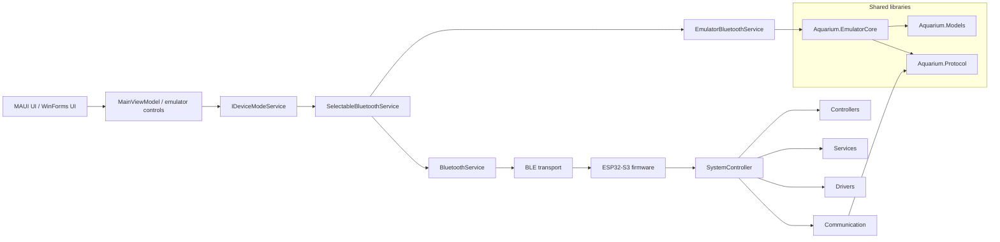

# Architecture

This document describes the refactored aquarium IoT architecture.

## Overview

The system is split into four major runtime areas:

- ESP32-S3 firmware
- MAUI application
- WinForms emulator
- shared protocol and model libraries

## System Diagram



## Layers

### Core

- Central orchestration of the device state.
- Owns the main decision flow and scheduling.
- In firmware this role is centered around `SystemController`.
- In emulator mode this role is represented by `EmulatedDeviceCore`.

### Controllers

- Temperature control
- Feeding control
- Lighting control
- Aeration control

### Services

- WiFi and HTTP API
- BLE transport
- OTA updates
- Persistent configuration

### Drivers

- DS18B20
- RTC
- OLED
- Servo
- Relay outputs

### Communication

- JSON parser and command dispatcher
- BLE protocol
- HTTP API
- shared protocol envelope

## Shared Libraries

### Aquarium.Models

Canonical domain objects used by the emulator, MAUI app and tests:

- `DeviceStatus`
- `TemperatureData`
- `RelayState`
- `Schedule`
- `FeederStatus`
- `SystemInfo`
- `DeviceConfig`

### Aquarium.Protocol

Shared contract and compatibility layer:

- `ProtocolEnvelope<TPayload>`
- `DeviceCommand`
- `DeviceResponse`
- `DeviceEvent`
- `OtaRequest`
- `IDeviceConnection`
- `IDeviceProtocol`
- `IDeviceController`
- `AquariumBleContract`
- legacy DTOs and mappers

The canonical envelope format is:

```json
{
  "type": "command | status | event | response",
  "name": "string",
  "payload": {}
}
```

The current runtime keeps compatibility with the legacy compact JSON payloads used by the firmware. The new envelope and models are the shared contract for new code and for future protocol evolution.

### Aquarium.EmulatorCore

Device simulation engine shared by:

- `apps/Aquarium.Emulator`
- `mobile-app` in `Emulator` mode

The emulator simulates:

- temperature changes
- relay states
- feeder jams
- sensor failures
- uptime
- OTA state
- status snapshots

## Application Flow

1. User interacts with the MAUI UI.
2. `MainViewModel` reads the selected connection mode.
3. `SelectableBluetoothService` routes calls to real BLE or emulator transport.
4. `BluetoothService` speaks to the ESP32-S3 firmware over BLE.
5. `EmulatorBluetoothService` speaks to `EmulatedDeviceCore`.
6. Both paths return the same logical status/settings/info objects.

## Firmware Flow

1. BLE or HTTP request reaches the device.
2. Communication layer parses JSON and dispatches commands.
3. `SystemController` coordinates work.
4. Controllers execute domain logic.
5. Drivers update hardware.
6. Response payload is serialized back to the caller.

## Compatibility Notes

- The wire JSON was kept stable unless a compatibility wrapper was needed.
- `LegacyModelMappers` convert old payloads to canonical shared models and back.
- This allows the emulator and MAUI app to share one data model without forcing a breaking firmware rewrite.

## Emulator Mode

The MAUI app can switch between:

- `RealDevice`
- `Emulator`

The selected mode is stored via `DeviceModeService` and routed by `SelectableBluetoothService`.

## Physical Layout

Current repository paths:

- `AquariumController.slnx` - root .NET solution
- `firmware/` - ESP32-S3 firmware
- `mobile-app/` - MAUI host
- `apps/Aquarium.Emulator/` - WinForms emulator
- `shared/` - shared .NET libraries
- `docs/` - documentation
- `tools/` - test and simulator helpers

The current MAUI source tree remains in `mobile-app/`, but architecturally it represents the `Aquarium.Mobile` and `Aquarium.Desktop` roles requested in the new layout.
