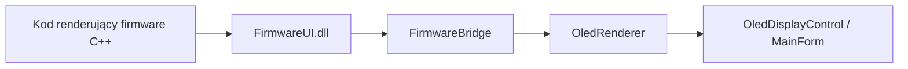

# Emulatory

## Zakres

Repozytorium zawiera kilka emulatorów o różnych celach. Ten dokument opisuje ich odpowiedzialności, sposób działania i ograniczenia.

## Typy emulatorów

### 1. Emulator funkcjonalny urządzenia

Ścieżka: `apps/Aquarium.Emulator/`

To emulator zachowania urządzenia. Symuluje stan sterownika, ekspozycję API i część reakcji firmware, ale nie renderuje lokalnego OLED na podstawie natywnego kodu C++.

### 2. Emulator UI firmware

Ścieżka: `tools/simulator/`

To emulator renderingu OLED. Uruchamia realny kod renderujący firmware przez natywną bibliotekę `FirmwareUI.dll` i wyświetla pikselowo zgodny framebuffer `128x32`.

### 3. Emulator analityczny UI

Ścieżka: `tools/testy/Aquarium.ControllerEmulator/`

To eksperymentalne narzędzie, które analizuje źródła firmware i buduje model UI na podstawie parsingu C++. Nie jest równoważne z wykonaniem realnego kodu firmware.

## Emulator funkcjonalny

### Jak działa

`apps/Aquarium.Emulator/` wykorzystuje `shared/Aquarium.EmulatorCore/EmulatedDeviceCore`, który implementuje `IDeviceController`. Emulator utrzymuje własny stan urządzenia, czas, status OTA, błędy sensora i feeder jam.

### Główne klasy

- `EmulatedDeviceCore` - rdzeń symulacji urządzenia, odpowiedzialny za stan, komendy i ustawienia.
- `EmulatorHttpApiServer` - lokalny serwer HTTP na `127.0.0.1:5080`, udostępniający kompatybilne endpointy do testów.
- `FirmwareJsonWriter` - serializacja statusu i konfiguracji do formatu zbliżonego do firmware.
- `MainForm` - operatorski panel WinForms do sterowania emulacją.

### Co symuluje

- temperaturę,
- dostępność sensora temperatury,
- feeder jam,
- połączenie klienta,
- uptime i zegar urządzenia,
- podstawowy przepływ OTA,
- komendy `feed_now`, `set_servo`, `clear_servo`, `clear_critical_logs`.

### Czego nie symuluje

- realnego FreeRTOS i wielowątkowości firmware,
- realnego hardware interface,
- rzeczywistej logiki pinów, sleep i driverów,
- rzeczywistego renderingu OLED firmware.

## Emulator UI firmware

### Architektura

### Jak działa

`tools/simulator/FirmwareUI/` buduje natywną bibliotekę `FirmwareUI.dll`, która:

- emuluje `U8g2` przez `FakeU8g2`,
- kompiluje realne funkcje renderujące firmware,
- eksportuje prosty interfejs C do obsługi przycisków i odczytu framebufferu.

WinForms host w `tools/simulator/Aquarium.ControllerEmulator/` ładuje DLL i renderuje obraz na desktopie.

### Główne klasy

- `FirmwareBridge` - abstraction layer do ładowania `FirmwareUI.dll`, wywoływania eksportów i pobierania framebufferu.
- `OledRenderer` - konwersja bufora `128x32` do bitmapy WinForms.
- `OledDisplayControl` - kontrolka renderująca emulowany OLED.
- `MainForm` - warstwa UI emulatora z przyciskami, ręcznym podaniem parametrów i logów.

### Użycie

Ten emulator służy do:

- sprawdzania lokalnej state machine OLED,
- wizualnego debugowania układu ekranu,
- testowania reakcji na przyciski i dane pomocnicze,
- walidacji zmian w warstwie renderującej bez wgrywania firmware na ESP32.

## Emulator analityczny UI

### Jak działa

`tools/testy/Aquarium.ControllerEmulator/` analizuje pliki `firmware/src/*.cpp`, `*.h`, `*.ino` i buduje model UI przez klasy:

- `FirmwareAnalyzer`,
- `CppParser`,
- `UiModel`,
- `UiStateMachine`.

To narzędzie jest przydatne do eksploracji struktury UI, ale nie uruchamia realnego kodu renderującego firmware.

## Relacja z aplikacją MAUI

Aplikacja w `mobile-app/` może działać w dwóch trybach:

- `RealDevice` - rzeczywiste BLE,
- `Emulator` - `EmulatorBluetoothService`, który opakowuje `EmulatedDeviceCore`.

Oznacza to, że emulator funkcjonalny jest bezpośrednio częścią ścieżki developerskiej UI, a emulator OLED jest osobnym narzędziem dla warstwy lokalnego interfejsu firmware.

## Design Decisions

- Emulator funkcjonalny używa shared models i shared protocol zamiast kopiować kontrakty aplikacji.
- Emulator OLED działa na realnym kodzie renderującym, aby zmniejszyć ryzyko rozjazdu wyglądu lokalnego UI.
- Emulator analityczny został zachowany jako narzędzie eksperymentalne do szybkiego rozpoznawania state machine i ekranów.

## Known Limitations

- Emulator funkcjonalny nie odwzorowuje w pełni zachowania FreeRTOS, Wi-Fi, power management i hardware timing.
- Emulator OLED nie symuluje całej logiki urządzenia; skupia się na wejściu i framebufferze.
- Istnienie kilku emulatorów zwiększa złożoność onboardingową projektu.

## Future Improvements

- Zintegrowanie emulatora funkcjonalnego i emulatora OLED w jeden spójny workflow developerski.
- Dodanie scenariuszy regresyjnych uruchamianych automatycznie na emulatorze.
- Ujednolicenie nomenklatury i ścieżek tak, aby z repo jasno wynikało, który emulator służy do czego.
